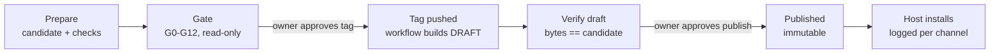

# GitHub Release

By **[Jesse Raber](https://jesseraber.net)** — owner of Unique WoodWorx and builder of practical AI workflows for real-world businesses. [Consulting](https://jesseraber.net) · [YouTube](https://www.youtube.com/@Jesse_Raber)

An Agent Skill that teaches AI agents to set up skill repositories and release them right the first time: a version gate before any tag, deterministic packages for each AI host, draft-first publishing, verification that published bytes equal the tested build, and a dated per-host install log.

## Which ZIP do I download?

| Your AI app | Download |
|---|---|
| Claude app, ChatGPT/Codex standalone skills, Antigravity, local models, any skills folder | `…-UNIVERSAL-skill.zip` |
| Claude Code `/plugin install` | `…-claude-code-plugin.zip` |
| Codex / ChatGPT plugin | `…-codex-chatgpt-plugin.zip` |
| Microsoft Copilot agent, Grok | `…-microsoft-copilot-agent-only.zip` |
| Gemini Apps | `…-gemini-apps-only.zip` |
| Opal | `…-opal-only.zip` |

## The flow it enforces

## What it enforces

- Creating a repository, pushing, tagging, publishing, changing settings and installing into hosts are separate owner approvals.
- Gate first, tag second. The release workflow creates a **draft**; the draft's assets are verified against the local candidate before a person publishes.
- Published bytes are never replaced. A defect ships as a new patch version.
- Every host rule carries a date and a source.

## Layout

`skills/github-release/` is the skill. `packaging/` builds and checks releases of this repository with the skill's own templates.

## About the author

I'm Jesse Raber, owner of [Unique WoodWorx](https://uniquewoodworx.com), a custom cabinet shop in Odon, Indiana. I built this skill because my own AI-driven releases kept going wrong in ways the agents couldn't see. If you want help putting AI agents to work in your business — CNC, cabinet software, or workflows like this one — that's what I do at [jesseraber.net](https://jesseraber.net). Build and release walkthroughs: [YouTube](https://www.youtube.com/@Jesse_Raber).

MIT licensed.
